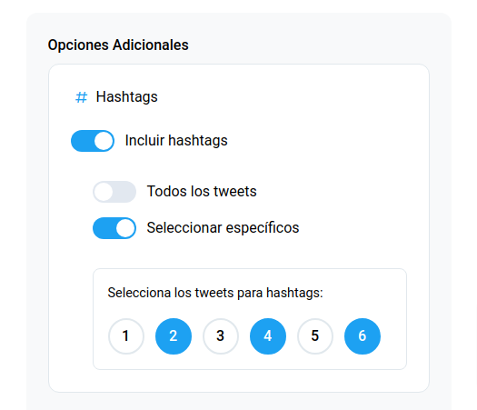
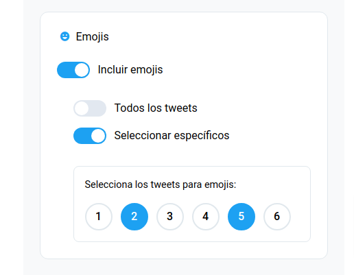
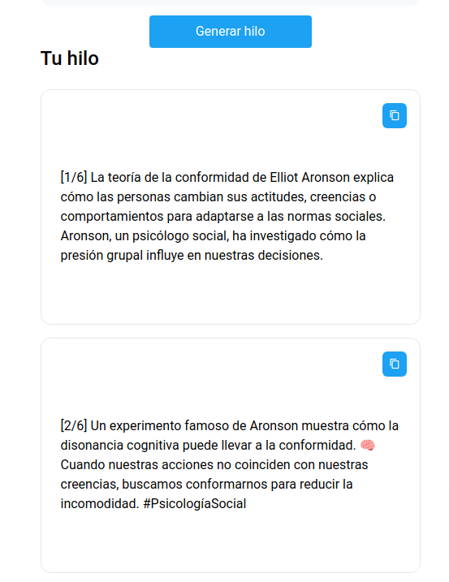

# 🧵 Generador de Hilos para X.com con Grok

<div align="center">


Una aplicación web en Flask que genera hilos de tweets personalizados usando el modelo Grok de X.AI.

[Características](#características) •
[Demo](#demo) •
[Instalación](#instalación) •
[Uso](#uso) •
[Documentación](#documentación) •
[Contribuir](#contribuir)

</div>

## 🎯 Características Principales

### 📝 Generación de Contenido
- **Tema Principal**: Define el tema central de tu hilo
- **Contexto Adicional**: Añade información complementaria para mejor contexto
- **Número de Tweets**: Elige entre 2 y 20 tweets para tu hilo
- **Estilos de Escritura Disponibles**:
  - 👔 Formal y Profesional
  - 💬 Casual y Conversacional
  - 😄 Humorístico
  - 😏 Sarcástico
  - 📚 Educativo
  - 💪 Inspirador y Motivacional
  - 🔬 Técnico y Detallado
  - 📖 Narrativo (Storytelling)

### 🎨 Personalización

#### Hashtags
- **Modo Automático**: Añade hashtags a todos los tweets
- **Modo Personalizado**: Selecciona en qué tweets específicos incluir hashtags
- **Modo Desactivado**: Sin hashtags

#### Emojis
- **Modo Completo**: Incluye emojis en todos los tweets
- **Modo Selectivo**: Elige tweets específicos para incluir emojis
- **Modo Desactivado**: Sin emojis

### 🌓 Interfaz
- Tema claro/oscuro
- Diseño responsive
- Copiado rápido de tweets
- Previsualización de estilos

## 📸 Demo

### Vista General

*Vista completa de la aplicación*


### Opciones de Hashtags

*Configuración de hashtags*

### Opciones de Emojis

*Configuración de emojis*

### Resultado

*Ejemplo de hilo generado*

## 📋 Tabla de Contenidos

- [🧵 Generador de Hilos para X.com con Grok](#-generador-de-hilos-para-xcom-con-grok)
  - [🎯 Características Principales](#-características-principales)
    - [📝 Generación de Contenido](#-generación-de-contenido)
    - [🎨 Personalización](#-personalización)
      - [Hashtags](#hashtags)
      - [Emojis](#emojis)
    - [🌓 Interfaz](#-interfaz)
  - [📸 Demo](#-demo)
    - [Vista General](#vista-general)
    - [Opciones de Hashtags](#opciones-de-hashtags)
    - [Opciones de Emojis](#opciones-de-emojis)
    - [Resultado](#resultado)
  - [📋 Tabla de Contenidos](#-tabla-de-contenidos)
  - [⚙️ Instalación](#️-instalación)
    - [Requisitos Previos](#requisitos-previos)
    - [Configuración](#configuración)
  - [🚀 Uso](#-uso)
  - [🔧 Tecnologías](#-tecnologías)
  - [📖 Documentación](#-documentación)
    - [API de Grok](#api-de-grok)
    - [Estructura del Proyecto](#estructura-del-proyecto)
  - [🤝 Contribuir](#-contribuir)
  - [📄 Licencia](#-licencia)

## ⚙️ Instalación

### Requisitos Previos

```bash
# Versiones requeridas
Python >= 3.8
pip >= 21.0
```

### Configuración

1. **Clonar el repositorio**
```bash
git clone https://github.com/686f6c61/generador-hilos-twitter-x-grok.git
cd generador-hilos-twitter-x-grok
```

2. **Instalar dependencias**
```bash
pip install -r requirements.txt
```

3. **Configurar variables de entorno**
```bash
# Crear archivo .env
XAI_API_KEY=tu_clave_de_api
FLASK_ENV=development
```

4. **Ejecutar la aplicación**
```bash
python app.py
```

## 🚀 Uso

1. Accede a `http://localhost:5000`
2. Ingresa el tema principal del hilo
3. Selecciona el estilo de escritura
4. Configura opciones de hashtags y emojis
5. ¡Genera tu hilo!

## 🔧 Tecnologías

- **Backend**: Flask, Python
- **Frontend**: JavaScript, Bulma CSS
- **IA**: API Grok de X.AI
- **Almacenamiento**: LocalStorage

## 📖 Documentación

### API de Grok

La integración con Grok se realiza mediante prompts estructurados:

```python
prompt = f"""
Tema: {tema}
Estilo: {estilo}
Tweets: {num_tweets}
...
"""
```

### Estructura del Proyecto

```
generador-hilos/
├── app.py           # Servidor Flask y lógica principal
├── static/          # Archivos estáticos
│   ├── css/         # Estilos
│   └── js/          # JavaScript
├── templates/       # Plantillas HTML
└── requirements.txt # Dependencias
```

## 🤝 Contribuir

1. Fork el proyecto
2. Crea una rama (`git checkout -b feature/amazing`)
3. Commit tus cambios (`git commit -m 'Add: feature'`)
4. Push a la rama (`git push origin feature/amazing`)
5. Abre un Pull Request

## 📄 Licencia

Este proyecto está bajo la Licencia MIT. Ver [LICENSE](LICENSE) para más detalles.

